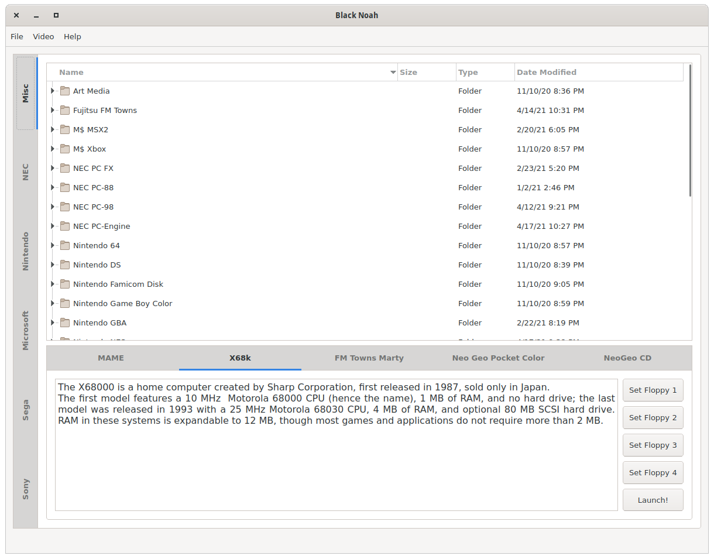

# Black Noah
BlackNoah is a graphical user interface for various consoles and computer systems working with the MAME emulator.

This was made using Qt Creator and thus the project file can be loaded and compiled with it.

This works with Linux and Windows, dependencies and libs were provided by linuxdeployqt and WindeployQt.

https://github.com/probonopd/linuxdeployqt

# How to compile

## Compiling for Linux
If you don't want to use Qt Creator you can use the compile scripts or do it directly with CLI (only for Linux).
Run compile.sh for an automatic build. 

Or run:
```zsh
mkdir build
cmake -S . -B build
cd build
make
```
## Compiling for Windows from Linux

Run compileForWindows.sh. This requires mingw64 and some form of mingw64-qt5 depending on your distro.

# How to use

This frontend works with the MAME emulator.
For Linux systems: 
MAME must be instaled in the typical bin folders of your system. Files for PSX memory card must be located at ~/.mame/memcard(/psx.mc1 and /psx.mc2) for the Playstation launcher.


For Windows systems:
Place Blacknoah.exe and dependencies in the same folder as your MAME executable (make sure its either mame.exe or MAME.exe) with the rest of MAME's folders. This frontend also requires ps1 memory card files located at memcard(/psx.mc1 and /psx.mc2) for the Playstation launcher.

Bios files for each of the systems are required and must be placed where your MAME instalation looks for the rom path.



