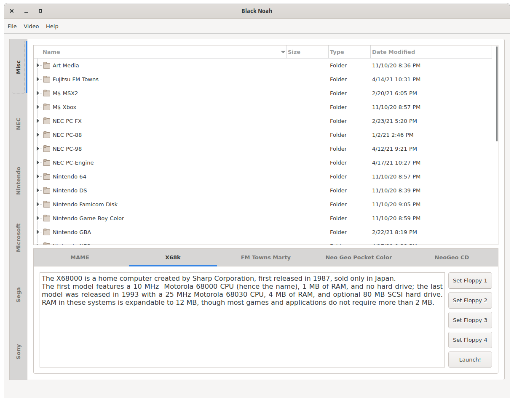

# Black Noah
BlackNoah is a graphical user interface for various consoles and computer systems working with the MAME emulator.

Supported systems:

| Vendor    | Systems                                                   |
|-----------|-----------------------------------------------------------|
| NEC       | PC-88, PC-98, PC Engine (HuCard and CD), PC-FX            |
| Nintendo  | NES, Famicom Disk System, SNES, N64, Game Boy Color, Game Boy Advance |
| Sega      | Master System, Mega Drive/Genesis, Sega CD, Saturn, Dreamcast |
| Sony      | PlayStation                                               |
| Microsoft | MSX                                                       |
| Other     | Sharp X68000, FM Towns Marty, Neo Geo Pocket Color, Neo Geo CD, plain MAME |

This was made using Qt Creator and thus the project file can be loaded and compiled with it.

This works with Linux and Windows, dependencies and libs were provided by linuxdeployqt and WindeployQt.

https://github.com/probonopd/linuxdeployqt

# How to compile

Requires Qt 5.14 or newer (Qt 6 is preferred), CMake 3.16+ and a C++17 compiler. All commands are run from the
`BlackNoah` folder.

## Compiling for Linux
If you don't want to use Qt Creator you can use the compile scripts or do it directly with CLI (only for Linux).
Run `./compile.sh` for an automatic build.

Or run:
```sh
cmake -S . -B build
cmake --build build
ctest --test-dir build   # optional, runs the unit tests
```

To install the binary, icon and desktop entry system-wide, run `./install.sh` as root after building.

## Compiling for Windows from Linux

Run `./compileForWindows.sh`. This requires mingw64 and some form of mingw64-qt5 depending on your distro.

# Setup

BlackNoah only launches MAME, so MAME and the BIOS files of each system you want to use must be installed.

**Linux:** MAME must be installed in the typical bin folders of your system (anywhere in `PATH`). BIOS files go
where your MAME installation looks for its ROM path. PlayStation memory cards are read from
`~/.mame/memcard/psx.mc1` and `psx.mc2`; the folder is created automatically.

**Windows:** Place `BlackNoah.exe` and its dependencies in the same folder as your MAME executable (either `mame.exe`
or `MAME.exe`) with the rest of MAME's folders. PlayStation memory cards are read from `memcard/psx.mc1` and
`memcard/psx.mc2`.

If MAME is somewhere else, use **File > Set MAME executable...**. Use **File > Set ROM path** to choose the folder
shown in the file browser.

# How to use

1. Pick the vendor tab and system tab, then select a ROM or disc image in the file browser.
2. Click the matching "Set ..." button to assign the file to a slot (floppy 1, CD-ROM, cartridge, ...), then click
   the launch button. Hover over a "Set ..." button to see which file it holds.
3. Shortcuts for launching:
   - Double-click a file to launch it with the current tab's system.
   - Right-click a file for "Set as ..." and "Launch with ...".
   - **Ctrl+Return** launches the current tab.
   - **Recent** menu re-launches earlier games.

The filter box in the status bar narrows the file list. Shader and region choices, selected files, window size and
open tabs are remembered between runs. The **Video** menu holds the global "Unevenstretch" and "Shader" toggles.

If MAME fails to start or exits with an error, its error output is shown in a dialog. The full log of the last run
of each machine is kept in the app data folder (`~/.local/share/blacknoah/logs` on Linux).

## Settings

Settings are saved to `~/.config/blacknoah/blacknoah.ini` (an existing `blacknoah.ini` next to the program is
migrated on first start). MAME machine names can be overridden in a `[MachineOverrides]` section, which is useful when
MAME renames a machine:

```ini
[MachineOverrides]
pc9821cx3=pc9821ce
```


